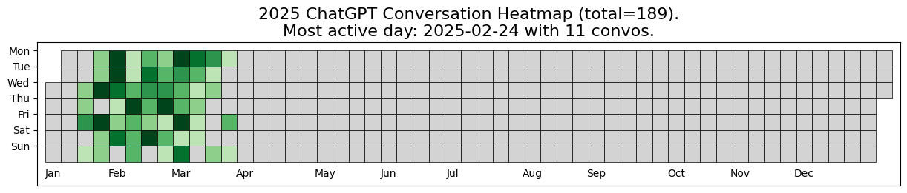
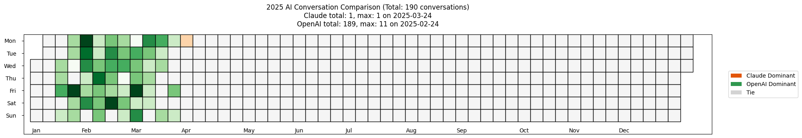

# llm-usage-visualizer

**Track and compare your ChatGPT & Claude usage trends over time.**

This project provides scripts to visualize your usage of ChatGPT and Claude, helping you analyze patterns, peak usage times, and switching behavior between the two models.

---

## 🚀 Features

✅ **Visualize ChatGPT usage trends** 📅  
✅ **Compare ChatGPT vs. Claude usage over time** 📈  
✅ **Generate heatmaps for yearly analysis** 🔥  
✅ **Supports time zone conversion** 🌍  
✅ **Easy customization for different AI models** 🛠️  

---

## 📦 Installation

Clone this repository and install dependencies:

```bash
# Clone the repo
git clone https://github.com/Aasif23/llm-usage-visualizer.git
cd llm-usage-visualizer

# Install dependencies
pip install -r requirements.txt
```

---

## 📂 Data Preparation

### **1️⃣ Export ChatGPT Conversations**
- Go to ChatGPT **Settings → Data Controls → Export**
- Download and unzip the exported data
- Set `convo_folder` in the script to the extracted folder path

### **2️⃣ Export Claude Conversations (Optional)**
- Go to Claude **Settings → Account → Data → Export Data**
- Download and unzip the exported data
- Set `claude_convo_folder` in the script

---

## 🛠️ Usage

### **1️⃣ Visualize ChatGPT Usage**

Run the script to generate a yearly heatmap for ChatGPT usage:

```python
from visualize import create_year_heatmap

convo_folder = 'export_chatgpt'  # Update with your folder path
local_tz = 'Asia/Kolkata'
create_year_heatmap(convo_folder, 2024)
```

This will generate a heatmap similar to this:

📌 **Example Output:**  


### **2️⃣ Compare ChatGPT vs. Claude Usage**

Run the comparison script:

```python
from visualize import create_comparison_heatmap

claude_convo_folder = 'export_claude'  # Update with your Claude data folder
create_comparison_heatmap(convo_folder, claude_convo_folder, 2024)
```

📌 **Example Output:**  


---

## ⚙️ Customization

You can customize various parameters:

- **Change Timezone:** Modify `local_tz = 'Your_Timezone'`
- **Adjust Color Themes:** Edit `plt.cm.Greens`, `plt.cm.Oranges`
- **Modify Yearly Range:** Update `create_year_heatmap(convo_folder, YEAR)`

---

## 📌 Roadmap

🔲 Add support for more AI models (Gemini, Copilot, etc.)  
🔲 Implement interactive dashboards  
🔲 Support cloud-based data storage  

---

## 🤝 Contributing

We welcome contributions! Feel free to submit pull requests or open issues.

---

## 📜 License

This project is licensed under the MIT License. See `LICENSE` for details.

---

## ⭐ Show Your Support!
If you find this project useful, please give it a ⭐ and share it with others!

---

📧 **Contact:** For any queries, reach out to [your email or GitHub profile].
